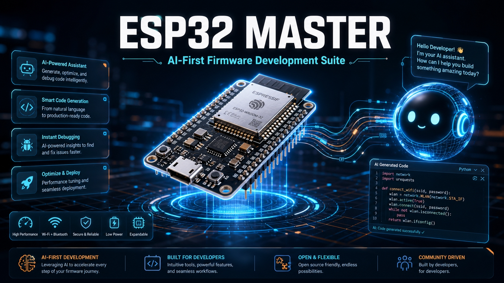
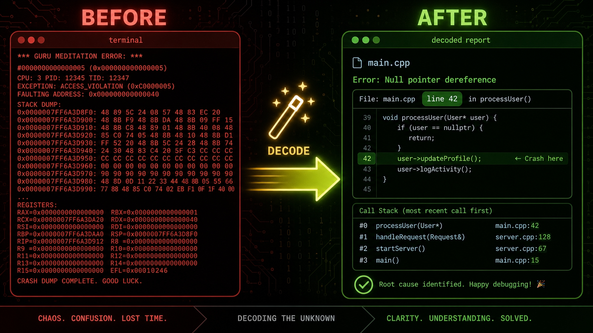
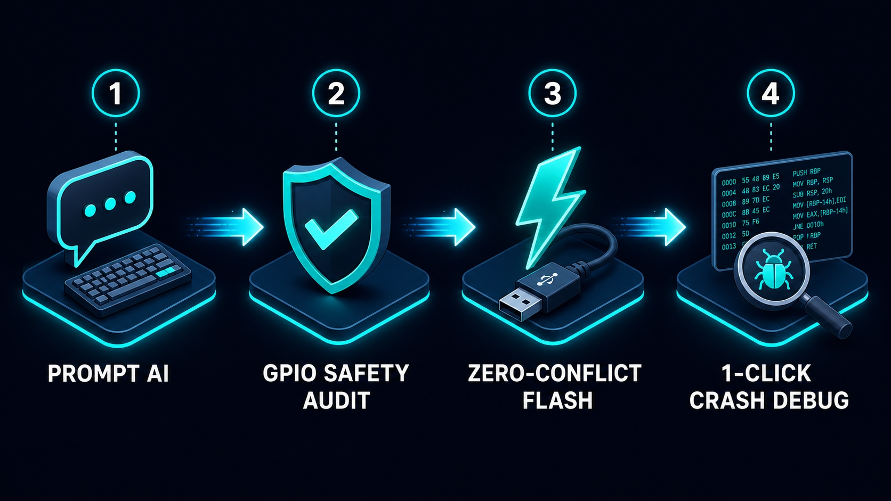
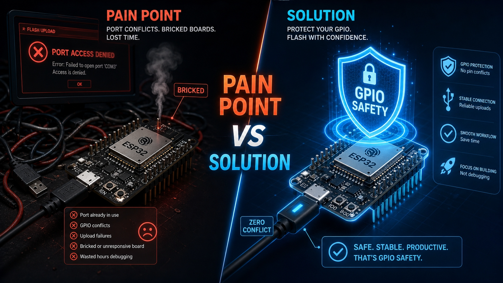

# ⚡ ESP32 Master

[](https://github.com/tody-agent/esp32-master/releases)
[](https://opensource.org/licenses/MIT)
[](https://modelcontextprotocol.io)
[](https://microsoft.com/windows)



> **ESP32 Master** is the ultimate AI-first embedded suite & Model Context Protocol (MCP) server for **ESP32 / ESP32-S3** microcontrollers using **Arduino CLI**.

It seamlessly bridges AI coding assistants (**Claude Desktop**, **Cursor**, **OpenAI Codex**, **Antigravity**, **Roo Code**) with physical ESP32 hardware. It turns natural language prompts into compiled, verified, zero-conflict flashed firmware with instant 1-click crash stack trace decoding.

🌐 **Tiếng Việt**: Đọc bản tài liệu tiếng Việt đầy đủ tại [README_VI.md](README_VI.md).

---

## ⚡ The Ultimate Pain-Point Solution Matrix



| Traditional Embedded Pain | ESP32 Master AI Solution | Value Generated |
|---|---|---|
| ❌ **COM Port Access Denied**<br>Serial monitor and uploader fight for the COM port. | ⚡ **Smart Lock Arbitrator**<br>Serial monitor auto-pauses, releases COM port, flashes binary, and resumes automatically. | **100% Zero Port Conflicts** |
| ❌ **Cryptic Hex Crash Dumps**<br>`Guru Meditation Error` register dumps require manual `addr2line`. | ⚡ **1-Touch Stack Trace Decrypter**<br>Translates hex memory addresses into exact C++ source filenames & line numbers in <2s. | **Instant Root Cause Fix** |
| ❌ **Cluttered CLI / Raw Terminal**<br>Hard to monitor logs or trigger commands from mobile devices. | ⚡ **ESP32 Mobile & Desktop Web Studio**<br>Intuitive dashboard with visual heartbeat ring & touch controls at `http://localhost:8321`. | **Premium Mobile UX** |
| ❌ **Accidental Hardware Damage**<br>Misconfiguring strapping/boot pins can brick hardware. | ⚡ **GPIO Safety Auditor**<br>Scans code pin initializations before flashing to prevent short circuits. | **Total Hardware Safety** |

---

## 🚀 How It Works: 4-Step AI Automated Workflow



### 1. 🤖 Prompt Your AI Assistant
Ask **Claude Desktop**, **Cursor**, or **Codex** in plain natural language:
> *"Write an ESP32 sketch reading GPIO4 temperature sensor and controlling onboard LED."*

### 2. 🛡️ Safety Audit & Automated Compilation
AI invokes `audit_gpio_safety` to ensure pin safety, then compiles using `compile_sketch` via `arduino-cli`.

### 3. 🔒 Conflict-Free Flash
AI invokes `upload_sketch`. ESP32 Master's **Smart Lock Arbitrator** auto-pauses the serial monitor, releases the COM port, flashes the binary, and re-engages logging.

### 4. 💡 Instant Smart Repair & Crash Decoding
If the ESP32 encounters a `Guru Meditation Error`, AI invokes `decode_stack_trace` to translate raw hex dumps into exact C++ filenames and line numbers in <2 seconds.

---

## 📱 Mobile & PC Visual Web Studio (`http://localhost:8321`)



In addition to full AI agent automation, ESP32 Master includes a visual web studio:
- **Visual Heartbeat Indicator**: Pulsing status ring showing real-time ESP32 health.
- **Smart Repair Assistant**: Plain-language Vietnamese & English crash diagnosis.
- **Real-Time Log Stream**: Monospaced terminal with live filtering (`INFO`, `WARN`, `PANIC`).
- **Touch Controls**: 1-click serial command buttons (**LED ON/OFF**, **Reboot**, **Decode Crash**).
- **Mobile-First Design**: Floating bottom nav bar, 48px+ touch targets, bilingual i18n support.

---

## 🛠️ Registered 12 MCP Tools Reference

### Adding to AI Clients

Add `esp32-master` to your AI client config (e.g. `%APPDATA%\Claude\claude_desktop_config.json`):

```json
{
  "mcpServers": {
    "esp32-master": {
      "command": "python",
      "args": [
        "C:/Adruino/Esp32-Master/mcp/mcp_server.py"
      ],
      "env": {
        "LOCALAPPDATA": "C:/Users/YOUR_USER/AppData/Local"
      }
    }
  }
}
```

### Complete MCP Tools List

| Tool Name | Key Function & Value |
|---|---|
| `detect_com_port` | Auto-detects connected ESP32 COM port and USB CDC details. |
| `compile_sketch` | Compiles Arduino C++ sketch using `arduino-cli`. |
| `upload_sketch` | Safely flashes binary to ESP32 with zero COM port conflicts. |
| `start_serial_monitor` | Launches background serial monitor with `.cm/serial_input.queue`. |
| `read_serial_logs` | Reads live serial log stream for AI analysis. |
| `send_serial_command` | Enqueues command strings to serial monitor input queue. |
| `decode_stack_trace` | Translates raw hex stack trace to exact C++ source file & line numbers. |
| `launch_log_dashboard` | Launches mobile & desktop Web UI Studio at `http://localhost:8321`. |
| `simulate_sketch_logic` | Translates C++ logic to Python for host-side simulation without hardware. |
| `audit_gpio_safety` | Audits pin initialization to prevent short circuits & bricked boards. |
| `get_board_info` | Reads ESP32 chip revision, MAC address, and flash speed. |
| `configure_mock_sensor` | Configures simulated pin waveform output for testbenches. |

---

## 📄 License

This project is licensed under the **MIT License**.
