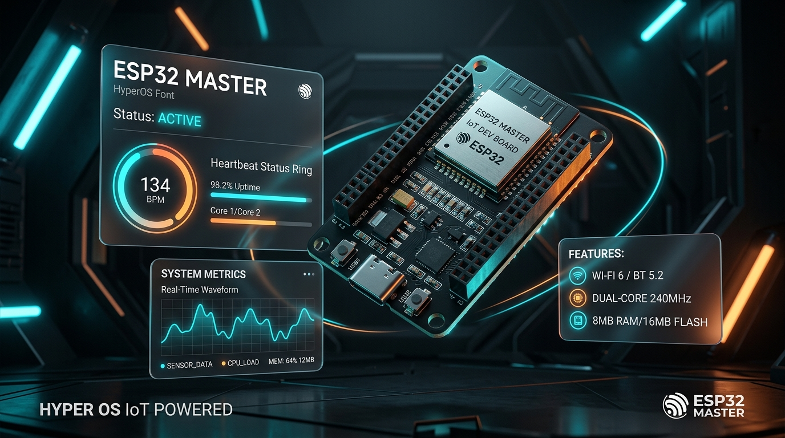
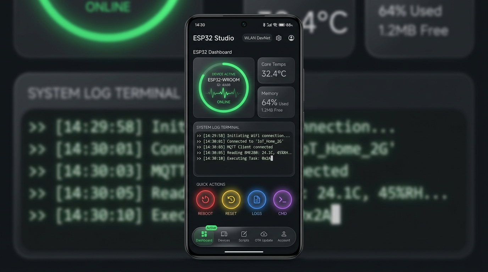
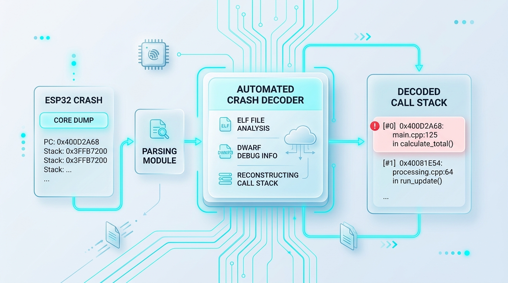

# ⚡ ESP32 Master

[](https://github.com/tody-agent/arduino-esp32-plugin/releases)
[](https://opensource.org/licenses/MIT)
[](https://modelcontextprotocol.io)
[](https://microsoft.com/windows)



> **ESP32 Master** is the ultimate AI-first and human-friendly developer suite and Model Context Protocol (MCP) server for professional **ESP32** firmware development using **Arduino CLI**.

Designed specifically for AI-assisted workflows (Cursor, Claude Desktop, Antigravity, Cline, Roo Code) as well as non-tech makers and professional IoT engineers. It eliminates the most frustrating pain points of embedded development: **COM port conflicts**, **cryptic hex stack crashes**, **lack of visual debugging**, and **accidental hardware damage**.

🌐 **Tiếng Việt**: Đọc bản tài liệu tiếng Việt đầy đủ tại [README_VI.md](README_VI.md).

---

## 🌟 Key Features

### 1. 📱 Web UI Mobile & Desktop Studio (`http://localhost:8321`)



- **Visual Heartbeat Ring**: Real-time pulsing green/red status indicator showing ESP32 health.
- **Smart Repair Assistant**: Automatically translates raw hex crash trace dumps into plain-language repair steps.
- **Real-Time Log Stream**: Monospaced terminal with live filtering (`INFO`, `WARN`, `PANIC`).
- **Touch-Friendly Controls**: Instant 1-click serial command buttons (**LED ON/OFF**, **Reboot**, **Decode Crash**).
- **Mobile-First Design**: Floating bottom navigation bar, 48px+ touch targets, zero-scroll mobile responsiveness.

### 2. 🔒 Zero-Conflict Serial Lock Manager
- **Automatic COM Port Arbitration**: Prevents `Access Denied` errors by automatically releasing the serial port when `arduino-cli` starts flashing and re-engaging immediately after upload completes.

### 3. 🔍 1-Click Crash Stack Trace Decrypter



- **Exact Line Number Resolution**: Resolves raw hex addresses (`Backtrace: 0x400d1254:0x3ffb1f20...`) into exact C++ source code filenames and line numbers using `addr2line` against the compiled `.elf` binary.

### 4. 🧪 Host-Side Logic Simulator & Waveform Mocks
- **Offline Logic Testing**: Translates C++ sketch logic into Python and executes state loops host-side without requiring physical microcontrollers connected.
- **Mock Waveform Generators**: Simulates sensor inputs (Sine wave, Noise, Constant, Ramp) for DHT, potentiometers, or voltage thresholds.

### 5. 🛡️ GPIO Pin Safety Auditor
- **Hardware Protection**: Scans source code before flashing to warn against driving boot-strapping pins (GPIO0, GPIO2, GPIO12, GPIO15) or causing short circuits on dedicated SPI flash pins.

---

## 💎 Pain Point vs. Solution Matrix

| Hardware Pain Point | ESP32 Master Solution | Benefit |
|---|---|---|
| **Port Access Denied**<br>Serial monitor and uploader fight for COM port. | **Automatic Lock Arbitration**<br>Serial monitor auto-pauses when upload starts. | **Zero Port Conflicts** |
| **Guru Meditation Crash**<br>Raw hex register dumps hard to read. | **Stack Trace Decrypter**<br>Translates hex addresses to file & line numbers in <2s. | **Instant Root Cause Fix** |
| **Command Line Logs**<br>Hard to filter or view on mobile devices. | **ESP32 Studio Web UI**<br>Visual dashboard at `http://localhost:8321`. | **Intuitive Monitoring** |
| **No Board Attached**<br>Can't test sketch logic offline. | **Python Logic Simulator**<br>Translates C++ loops to host-side Python. | **Offline TDD Testing** |
| **Bricked Hardware**<br>Accidentally driving boot pins. | **GPIO Safety Auditor**<br>Scans code for dangerous pin modes before flashing. | **Hardware Safety** |

---

## 🛠️ MCP Tool Reference (12 Available Tools)

`ESP32 Master` registers standard Model Context Protocol (MCP) tools for seamless integration with AI Agents:

| Tool Name | Parameters | Description |
|---|---|---|
| `detect_com_port` | `{ vid?: string, pid?: string }` | Auto-detects connected ESP32 COM port and USB CDC details. |
| `compile_sketch` | `{ sketch_path: string, fqbn?: string }` | Compiles Arduino C++ sketch using `arduino-cli`. |
| `upload_sketch` | `{ sketch_path: string, port: string }` | Safely flashes binary to ESP32 with auto lock release. |
| `start_serial_monitor` | `{ port: string, baud?: int }` | Launches background serial monitor with `.cm/serial_input.queue`. |
| `read_serial_logs` | `{ lines?: int }` | Reads recent lines from background serial monitor log. |
| `send_serial_command` | `{ data: string }` | Enqueues command string into serial monitor input queue. |
| `decode_stack_trace` | `{ log_text: string, elf_path: string }` | Translates raw hex stack trace to C++ source file & line numbers. |
| `launch_log_dashboard` | `{ port?: int }` | Launches Web UI Studio at `http://localhost:8321`. |
| `simulate_sketch_logic` | `{ sketch_path: string }` | Translates sketch logic to Python for host-side simulation. |
| `audit_gpio_safety` | `{ sketch_path: string }` | Audits pin initialization to prevent hardware short circuits. |
| `get_board_info` | `{ port: string }` | Fetches ESP32 chip revision, MAC address, and flash speed. |
| `configure_mock_sensor` | `{ pin: int, waveform: string }` | Configures simulated pin waveform output for testbenches. |

---

## ⚙️ Quick Start Guide

### 1. Prerequisites
- **OS**: Windows (PowerShell 5.1+)
- **Toolchain**: `arduino-cli` configured on your system `PATH`
- **Python**: Version 3.8+

### 2. Integration with AI Clients

Add `ESP32 Master` MCP server to your AI desktop client configuration (e.g. `%APPDATA%\Claude\claude_desktop_config.json` or Cursor / Antigravity MCP settings):

```json
{
  "mcpServers": {
    "esp32-master": {
      "command": "python",
      "args": [
        "C:/path-to-plugin/arduino-esp32-plugin/mcp/mcp_server.py"
      ],
      "env": {
        "LOCALAPPDATA": "C:/Users/YOUR_USER/AppData/Local"
      }
    }
  }
}
```

### 3. Launching Web UI Debugger Manually

Run the Web UI Studio directly from PowerShell:

```powershell
python C:\path-to-plugin\skills\cm-arduino-esp32\scripts\log_dashboard.py
```
Open **`http://localhost:8321`** in any web browser or mobile device.

---

## 📑 Complete Documentation Sitemap

Explore detailed technical guides in the `docs/` directory:

- 📂 [analysis.md](docs/analysis.md) — Structural layout, entry points, and script details.
- 👤 [personas.md](docs/personas.md) — Target user profiles (IoT Engineers, AI Agents, Non-Tech Makers).
- 🎯 [jtbd.md](docs/jtbd.md) — Functional/emotional Jobs-To-Be-Done and success metrics.
- 🔒 [flows.md](docs/flows.md) — Mermaid diagrams for serial lock arbitration and stack decoding.
- 🏗️ [architecture.md](docs/architecture.md) — Hybrid architecture engine details and design records.
- 📖 [SOP: Compiling & Flashing](docs/sop/sop-flashing.md) — Compilation and upload lock management.
- 📖 [SOP: Debugging & Decoding](docs/sop/sop-debugging.md) — Serial monitoring and stack trace decoding.
- 📖 [SOP: Simulation & Mocks](docs/sop/sop-simulation.md) — Logic simulation and sensor mock testing.
- 🛠️ [API Reference](docs/api/api-reference.md) — Complete JSON-RPC schemas and payload examples.

---

## 📄 License

This project is licensed under the **MIT License**.
