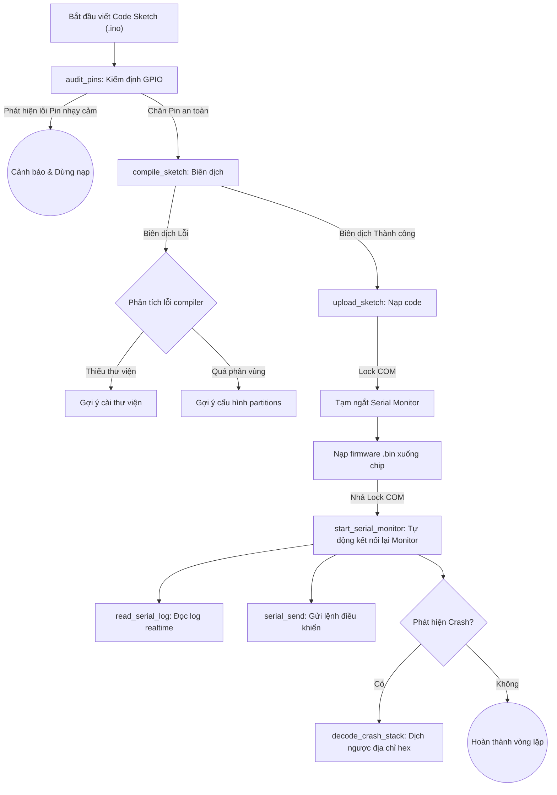

# Tài liệu Hướng dẫn Sử dụng: Bộ Plugin ESP32 Arduino CLI cho AI Agent

Chào mừng bạn đến với bộ Plugin chuyên dụng hỗ trợ lập trình **ESP32** tích hợp **Arduino CLI** dành cho các nền tảng AI Agent (như Antigravity, Claude Desktop, Cursor, Cline, Roo Code, Codex,...).

Bộ plugin này kết hợp sức mạnh của **Hệ thống Chỉ dẫn ngữ cảnh Phân mảnh (Modular Agent Skills)** và **Môi trường kết nối công cụ (MCP Server - Model Context Protocol)** để giúp AI của bạn lập trình, biên dịch, nạp code, giám sát Serial nối tiếp và tự động giải mã lỗi crash thời gian thực.

---

## 1. Sơ đồ Hoạt động Toàn diện (Development Lifecycle)

Dưới đây là sơ đồ mô tả vòng lặp phát triển phần cứng khép kín và an toàn được quản lý bởi bộ plugin:



---

## 2. Cấu trúc thư mục Plugin
Thư mục đóng gói `arduino-esp32-plugin` bao gồm:
```
arduino-esp32-plugin/
├── plugin.json                       # Định nghĩa cấu hình plugin (đăng ký 5 skill)
├── USER_GUIDE.md                     # Hướng dẫn chi tiết sử dụng này
├── mcp/
│   ├── mcp_server.py                 # MCP Server chuẩn (stdio) viết bằng Python (không phụ thuộc package ngoài)
│   └── config_example.json           # Cấu hình mẫu để tích hợp với Claude Desktop / Cursor
└── skills/                           # Hệ thống 5 Skills chuyên sâu
    ├── cm-arduino-esp32/             # Skill điều phối, bảng lệnh nhanh & TDD phần cứng
    │   ├── SKILL.md
    │   ├── scripts/                  # Bộ script PowerShell tự động hóa (.ps1)
    │   │   ├── detect_ports.ps1      # Dò tìm cổng nạp ESP32 tự động
    │   │   ├── serial_monitor.ps1    # Giám sát cổng nối tiếp ngầm qua lock file và hàng đợi gửi lệnh
    │   │   ├── decode_stack.ps1      # Tự động giải mã stack trace lỗi crash phần cứng
    │   │   └── audit_pins.ps1        # Kiểm tra an toàn GPIO trước khi nạp
    │   └── tests/                    # Bộ unit tests cho các script
    │       ├── detect_ports.tests.ps1
    │       ├── serial_monitor.tests.ps1
    │       ├── decode_stack.tests.ps1
    │       └── audit_pins.tests.ps1
    ├── cm-esp32-env/                 # Skill cấu hình môi trường, thư viện và Partitions
    │   └── SKILL.md
    ├── cm-esp32-build/               # Skill tối ưu build cache và đóng gói LittleFS/SPIFFS
    │   └── SKILL.md
    ├── cm-esp32-flash/               # Skill quy trình nạp code Serial & ArduinoOTA không dây
    │   └── SKILL.md
    └── cm-esp32-debug/               # Skill gỡ lỗi đa luồng FreeRTOS, memory leak, WDT và giải mã crash
        └── SKILL.md
```

---

## 3. Hướng dẫn Tích hợp & Cấu hình

> [!TIP]
> Bộ MCP Server được viết bằng Python stdio thuần túy, có sẵn khả năng tự quản lý lỗi, không yêu cầu cài đặt thêm thư viện Python nào (`zero-dependency`).

### Tùy chọn A: Dành cho Claude Desktop
Để kích hoạt các công cụ lập trình ESP32 trực tiếp trong ứng dụng Claude Desktop của bạn:
1.  Mở tệp cấu hình Claude Desktop:
    *   Đường dẫn: `%APPDATA%\Claude\claude_desktop_config.json`
2.  Thêm cấu hình máy chủ MCP của plugin vào tệp (tham khảo tệp `mcp/config_example.json`):
    ```json
    {
      "mcpServers": {
        "arduino-esp32-mcp": {
          "command": "python",
          "args": [
            "C:/ĐƯỜNG_DẪN_ĐẾN_THƯ_MỤC/arduino-esp32-plugin/mcp/mcp_server.py"
          ],
          "env": {
            "LOCALAPPDATA": "C:/Users/TÊN_USER_CỦA_BẠN/AppData/Local"
          }
        }
      }
    }
    ```
3.  Khởi động lại ứng dụng Claude Desktop.

### Tùy chọn B: Dành cho Cursor (IDE)
Để Cursor AI có khả năng tự nạp code và debug phần cứng:
1.  Mở Cursor, vào **Settings** > **Features** > **MCP**.
2.  Click **+ Add New MCP Server**.
3.  Điền thông tin:
    *   **Name:** `arduino-esp32-mcp`
    *   **Type:** `command`
    *   **Command:** `python -u "C:/ĐƯỜNG_DẪN_ĐẾN_THƯ_MỤC/arduino-esp32-plugin/mcp/mcp_server.py"`
4.  Nhấn **Save** để kết nối.

---

## 4. Các Công cụ Cung cấp bởi MCP (Tools Reference)

Sau khi tích hợp thành công, AI Agent của bạn sẽ có quyền gọi các công cụ sau:

1.  **`detect_ports`**: Quét các cổng COM trên Windows, tự động nhận dạng chip nạp ESP32 và lưu cấu hình mặc định vào `.cm/board_state.json`.
2.  **`compile_sketch`**: Biên dịch chương trình Arduino. Tự động bật tính năng build cache, lưu file trung gian `.elf` và **phân tích lỗi thông minh (diagnostics)**.
3.  **`upload_sketch`**: Tự động khóa luồng monitor, gọi `arduino-cli upload` để nạp code xuống chip (hỗ trợ lấy cổng mặc định từ cache), và tự động mở lại monitor sau khi hoàn tất.
4.  **`start_serial_monitor`**: Khởi động Job chạy ngầm để ghi log dữ liệu truyền lên từ ESP32 qua cổng COM vào tệp log của dự án và lắng nghe hàng đợi truyền lệnh hai chiều.
5.  **`read_serial_log`**: Đọc các dòng log dữ liệu mới nhất được ghi nhận từ chip nối tiếp.
6.  **`decode_crash_stack`**: Lấy log lỗi CPU panic hoặc Guru Meditation Error của ESP32, phân tích địa chỉ hex và dùng `addr2line` để biên dịch ngược ra tên tệp code và số dòng bị lỗi chính xác.
7.  **`serial_send`**: Truyền lệnh điều khiển (chuỗi ký tự) xuống thiết bị thông qua tiến trình monitor nối tiếp chạy nền.
8.  **`audit_pins`**: Kiểm tra an toàn GPIO, quét trước mã nguồn để ngăn chặn việc sử dụng chân cấm (như chân SPI flash GPIO 6-11) giúp tránh cháy chập hoặc treo chip.

---

## 5. Các Use Cases Thực tế (Step-by-Step Examples)

### Use Case 1: Vòng lặp phát triển an toàn (Write -> Audit -> Flashing)

Đây là quy trình chuẩn mà AI Agent nên thực hiện khi người dùng yêu cầu lập trình một tính năng mới.

*   **Bước 1: Viết mã nguồn**
    Agent tạo file `blink_led.ino`:
    ```cpp
    void setup() {
      pinMode(2, OUTPUT); // GPIO 2 là đèn LED trên board ESP32
    }
    void loop() {
      digitalWrite(2, HIGH);
      delay(1000);
      digitalWrite(2, LOW);
      delay(1000);
    }
    ```

*   **Bước 2: Kiểm tra an toàn phần cứng (`audit_pins`)**
    Agent gọi công cụ `audit_pins(sketch_path="blink_led")` để quét code:
    *   *Kết quả:* Trả về `[]` (Không phát hiện chân GPIO nhạy cảm).
    *   *Nếu cấu hình sai:* Ví dụ trong code có `pinMode(6, OUTPUT)` (chân liên kết bộ nhớ Flash), công cụ sẽ trả về:
        ```json
        [
          {
            "Pin": 6,
            "Severity": "ERROR",
            "Message": "SPI Flash Pin (CLK)... Gây crash chip lập tức.",
            "File": "blink_led.ino",
            "Line": 3
          }
        ]
        ```
        Agent sẽ lập tức phát hiện và sửa mã nguồn trước khi nạp xuống board.

*   **Bước 3: Biên dịch (`compile_sketch`)**
    Agent gọi công cụ `compile_sketch(sketch_path="blink_led")`. Trình biên dịch sẽ tự động bật build cache giúp hoàn tất biên dịch nhanh chóng và tạo ra file ELF trung gian tại `.cm/build/blink_led.ino.elf`.

*   **Bước 4: Nạp code (`upload_sketch`)**
    Agent gọi `upload_sketch(sketch_path="blink_led")`. Hệ thống tự động đọc cổng kết nối đã cache (ví dụ `COM4`) và nạp chương trình an toàn.

---

### Use Case 2: Điều khiển thiết bị và gửi lệnh hai chiều (Bidirectional Serial Monitor)

Khi bạn muốn gửi dữ liệu hoặc lệnh điều khiển từ máy tính xuống ESP32 thông qua cổng Serial đang chạy ngầm.

*   **Bước 1: Bật Serial Monitor nền**
    Agent gọi công cụ `start_serial_monitor()` để kích hoạt tiến trình đọc log ghi vào file `.cm/esp32_serial.log` chạy ngầm.

*   **Bước 2: Viết mã nguồn ESP32 nhận lệnh**
    ```cpp
    void setup() {
      Serial.begin(115200);
      pinMode(2, OUTPUT);
    }
    void loop() {
      if (Serial.available() > 0) {
        String command = Serial.readStringUntil('\n');
        command.trim();
        if (command == "ON") {
          digitalWrite(2, HIGH);
          Serial.println("LED_STATUS:ON");
        } else if (command == "OFF") {
          digitalWrite(2, LOW);
          Serial.println("LED_STATUS:OFF");
        }
      }
    }
    ```

*   **Bước 3: Gửi lệnh điều khiển (`serial_send`)**
    Agent gọi công cụ `serial_send(data="ON")`.
    *   *Luồng xử lý:* Server ghi dữ liệu `"ON"` vào hàng đợi `.cm/serial_input.queue`. Monitor nền quét thấy, truyền `"ON"` vào cổng COM của ESP32 và xóa hàng đợi.

*   **Bước 4: Xác nhận phản hồi từ log (`read_serial_log`)**
    Agent gọi công cụ `read_serial_log(lines_count=10)` để kiểm tra log:
    *   *Kết quả log:*
        ```text
        [2026-07-18 22:24:00.123] LED_STATUS:ON
        ```

---

### Use Case 3: Chẩn đoán & Khắc phục lỗi Compiler tự động (Smart Diagnostics)

Khi biên dịch lỗi, Agent có thể ngay lập tức tự động sửa chữa nhờ thông tin chẩn đoán cấu trúc.

*   **Tình huống A: Lỗi thiếu thư viện**
    *   *Code sử dụng:* `#include <DHT.h>` nhưng thư viện chưa được cài đặt.
    *   *Kết quả gọi `compile_sketch`:* Trả về lỗi kèm theo thông tin chẩn đoán:
        ```json
        {
          "exit_code": 1,
          "diagnostics": [
            {
              "type": "Missing Library",
              "header": "DHT.h",
              "suggestion": "Thiếu thư viện chứa header 'DHT.h'. Hãy tìm kiếm và cài đặt thư viện này bằng lệnh `arduino-cli lib search` và `arduino-cli lib install`."
            }
          ]
        }
        ```
    *   *Hành động của Agent:* Agent tự động gọi terminal chạy lệnh:
        ```powershell
        arduino-cli lib install "DHT sensor library"
        ```
        và tiến hành biên dịch lại thành công.

*   **Tình huống B: Tràn dung lượng ứng dụng (Sketch Too Large)**
    *   *Lỗi xảy ra:* Biên dịch sketch phức tạp, kích thước vượt quá 1MB mặc định của ESP32.
    *   *Chẩn đoán trả về từ `compile_sketch`:*
        ```json
        {
          "exit_code": 1,
          "diagnostics": [
            {
              "type": "Sketch Too Large",
              "suggestion": "Kích thước chương trình vượt quá phân vùng ứng dụng của ESP32. Hãy cấu hình bảng phân vùng lớn hơn bằng cách thêm thuộc tính `--build-property build.partitions=huge_app` hoặc `--build-property build.partitions=no_ota` vào lệnh compile."
            }
          ]
        }
        ```
    *   *Hành động của Agent:* Agent tự động cấu hình lại lệnh biên dịch với tham số partition mở rộng để vượt qua lỗi.

---

### Use Case 4: Giải mã lỗi Crash thời gian thực (Crash Stack Trace Decryption)

Khi ESP32 bị crash liên tục (ví dụ truy cập con trỏ null trong đa luồng FreeRTOS).

*   **Bước 1: Kiểm tra log Serial**
    Agent gọi `read_serial_log(lines_count=30)` và phát hiện dòng lỗi crash:
    ```text
    Guru Meditation Error: Core 1 panic'ed (StoreProhibited). Exception was not handled.
    Backtrace:0x400d0c35:0x3ffb1f20 0x400d0c7a:0x3ffb1f40
    ```

*   **Bước 2: Giải mã Stack Trace (`decode_crash_stack`)**
    Agent gọi công cụ `decode_crash_stack`:
    *   `log_text`: Chứa chuỗi backtrace trên.
    *   `elf_path`: Đường dẫn file ELF trung gian `.cm/build/my_app.ino.elf`.
    *   *Kết quả giải mã trả về từ công cụ:*
        ```text
        0x400d0c35 is at C:\Users\block\Documents\antigravity\jolly-planck\my_app/my_app.ino:14
        0x400d0c7a is at C:\Users\block\Documents\antigravity\jolly-planck\my_app/my_app.ino:22
        ```

*   **Bước 3: Sửa lỗi**
    Agent mở file `my_app.ino` tại dòng 14, phát hiện biến đối tượng chưa được khởi tạo trước khi gọi phương thức (`nullptr` access), tiến hành khởi tạo và nạp lại chương trình thành công.

---

## 6. Các Lưu ý Quan trọng khi Vận hành

> [!WARNING]
> **Xung đột cổng COM:**
> Cổng COM chỉ cho phép duy nhất một tiến trình kết nối tại một thời điểm. Bộ plugin tự động xử lý xung đột này bằng cơ chế lock file. Tuy nhiên, nếu bạn mở các phần mềm bên ngoài (như Arduino IDE Serial Monitor, Hercules, TeraTerm) kết nối vào cùng một cổng, lệnh `upload_sketch` sẽ báo lỗi `Access is denied`.

> [!IMPORTANT]
> **Nhấn nút BOOT trên mạch:**
> Trên một số board ESP32 giá rẻ, cổng nạp không tự động kích hoạt bootloader. Nếu quá trình nạp bị kẹt ở dòng `Connecting...`, hãy nhấn giữ nút **BOOT** trên board cho đến khi màn hình báo bắt đầu ghi dữ liệu (`Writing at ...`) rồi thả ra.
