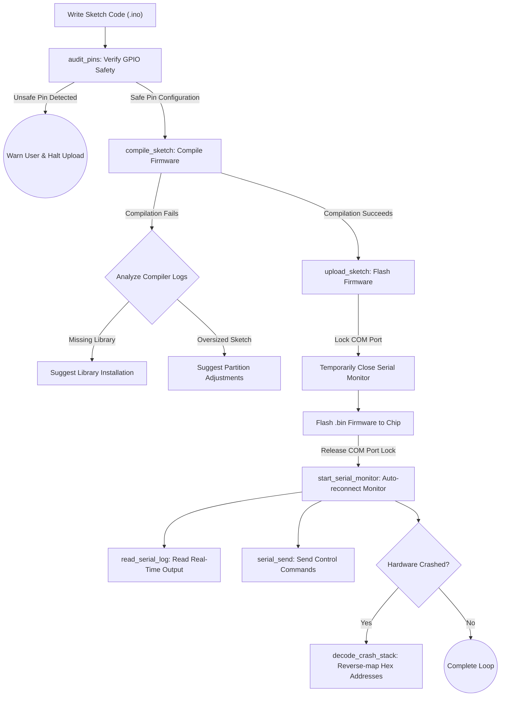

# User Guide: ESP32 Arduino CLI Developer Plugin for AI Agents

Welcome to the dedicated **ESP32** development plugin integrated with **Arduino CLI** for AI Agents (such as Antigravity, Claude Desktop, Cursor, Cline, Roo Code, Codex, etc.).

This plugin combines **Modular Agent Skills** with a **Model Context Protocol (MCP) Server** to empower your AI assistant to code, compile, flash, monitor bidirectional serial communication, and decode hardware crashes in real-time.

---

## 1. Development Lifecycle Diagram

Below is a flow diagram outlining the secure, closed-loop hardware development process managed by the plugin:



---

## 2. Directory Structure

The bundled `arduino-esp32-plugin` is organized as follows:
```
arduino-esp32-plugin/
├── plugin.json                       # Registers the 5 skills as metadata
├── README.md                         # Project introduction and bilingual links
├── USER_GUIDE_EN.md                  # This file
├── USER_GUIDE_VI.md                  # Vietnamese User Guide
├── mcp/
│   ├── mcp_server.py                 # Stdio-based Python MCP Server (zero-dependency)
│   └── config_example.json           # Example configuration for MCP clients
└── skills/                           # 5 Modular Agent Skills
    ├── cm-arduino-esp32/             # Orchestrator & Hardware TDD scripts
    │   ├── SKILL.md
    │   ├── scripts/                  # Automated PowerShell scripts (.ps1)
    │   │   ├── detect_ports.ps1      # Scans and identifies ESP32 COM ports
    │   │   ├── serial_monitor.ps1    # Logs serial output and handles command queue
    │   │   ├── decode_stack.ps1      # Decodes Guru Meditation crash address lists
    │   │   └── audit_pins.ps1        # Performs source code pin safety checks
    │   └── tests/                    # Pester unit tests
    │       ├── detect_ports.tests.ps1
    │       ├── serial_monitor.tests.ps1
    │       ├── decode_stack.tests.ps1
    │       └── audit_pins.tests.ps1
    ├── cm-esp32-env/                 # Skill for library, driver, and Partition management
    │   └── SKILL.md
    ├── cm-esp32-build/               # Skill for build cache and LittleFS/SPIFFS packaging
    │   └── SKILL.md
    ├── cm-esp32-flash/               # Skill for serial flashing and wireless ArduinoOTA
    │   └── SKILL.md
    └── cm-esp32-debug/               # Skill for FreeRTOS tasks, leaks, WDT, and stack decoder
        └── SKILL.md
```

---

## 3. Integration & Setup Guide

> [!TIP]
> The MCP Server is written using standard Python stdio without any external dependencies (`zero-dependency`), ensuring robust compatibility out-of-the-box.

### Option A: For Claude Desktop
To enable ESP32 programming tools inside the Claude Desktop application:
1.  Open the Claude Desktop configuration file:
    *   Path: `%APPDATA%\Claude\claude_desktop_config.json`
2.  Add the MCP server configuration pointing to your copy of the plugin (see `mcp/config_example.json`):
    ```json
    {
      "mcpServers": {
        "arduino-esp32-mcp": {
          "command": "python",
          "args": [
            "C:/YOUR_FOLDER_PATH/arduino-esp32-plugin/mcp/mcp_server.py"
          ],
          "env": {
            "LOCALAPPDATA": "C:/Users/YOUR_USERNAME/AppData/Local"
          }
        }
      }
    }
    ```
3.  Restart Claude Desktop.

### Option B: For Cursor (IDE)
To allow the Cursor AI assistant to build and flash hardware directly from the editor:
1.  Open Cursor and navigate to **Settings** > **Features** > **MCP**.
2.  Click **+ Add New MCP Server**.
3.  Enter the details:
    *   **Name:** `arduino-esp32-mcp`
    *   **Type:** `command`
    *   **Command:** `python -u "C:/YOUR_FOLDER_PATH/arduino-esp32-plugin/mcp/mcp_server.py"`
4.  Click **Save** to connect.

---

## 4. MCP Tools Reference

Once integrated, your AI Agent gains access to the following tools:

1.  **`detect_ports`**: Scans serial ports on Windows, identifies connected ESP32 chips, and caches config details in `.cm/board_state.json`.
2.  **`compile_sketch`**: Compiles an Arduino sketch. Enables build caches, generates `.elf` debug structures, and returns **smart compiler diagnostics**.
3.  **`upload_sketch`**: Suspends the serial monitor, runs `arduino-cli upload` (reads port from cache if omitted), and resumes the monitor once flashing completes.
4.  **`start_serial_monitor`**: Launches a background process logging device messages to `.cm/esp32_serial.log` while listening to the command queue for bidirectional inputs.
5.  **`read_serial_log`**: Returns the latest lines logged from the serial interface.
6.  **`decode_crash_stack`**: Parses hex address lists from CPU crash/Guru Meditation outputs and translates them back to specific C++ file lines using `addr2line`.
7.  **`serial_send`**: Pushes commands (string payloads) to the background monitor queue to transmit them down to the ESP32.
8.  **`audit_pins`**: Audits the sketch source files to check for unsafe GPIO pin usage (such as SPI flash pins 6-11) before flashing, preventing hardware damage.

---

## 5. Step-by-Step Use Cases

### Use Case 1: Secure Development Flow (Write -> Audit -> Flashing)

This is the recommended sequence that the AI Agent should follow when writing a new feature.

*   **Step 1: Write Code**
    The Agent creates `blink_led.ino`:
    ```cpp
    void setup() {
      pinMode(2, OUTPUT); // GPIO 2 is the onboard LED on most ESP32 boards
    }
    void loop() {
      digitalWrite(2, HIGH);
      delay(1000);
      digitalWrite(2, LOW);
      delay(1000);
    }
    ```

*   **Step 2: Check Hardware Safety (`audit_pins`)**
    The Agent calls `audit_pins(sketch_path="blink_led")` to verify safety:
    *   *Result:* Returns `[]` (Safe pin usage).
    *   *If unsafe code was present:* If the code configured `pinMode(6, OUTPUT)` (SPI Flash clock pin), the tool returns:
        ```json
        [
          {
            "Pin": 6,
            "Severity": "ERROR",
            "Message": "SPI Flash Pin (CLK)... Will brick or crash the chip immediately.",
            "File": "blink_led.ino",
            "Line": 3
          }
        ]
        ```
        The Agent immediately halts execution and corrects the sketch before flashing.

*   **Step 3: Compile (`compile_sketch`)**
    The Agent calls `compile_sketch(sketch_path="blink_led")`. The compiler runs with build-caching enabled to speed up subsequent cycles, and outputs the `.elf` binary to `.cm/build/blink_led.ino.elf`.

*   **Step 4: Upload (`upload_sketch`)**
    The Agent calls `upload_sketch(sketch_path="blink_led")`, auto-detecting the cached port (e.g. `COM4`) to safely deploy the firmware.

---

### Use Case 2: Bidirectional Board Control (Serial Sending)

When you need to transmit user commands or configuration scripts downward to the ESP32 via the background monitor.

*   **Step 1: Start background serial logging**
    The Agent calls `start_serial_monitor()` to begin logging to `.cm/esp32_serial.log`.

*   **Step 2: Prepare C++ code on ESP32 to receive commands**
    ```cpp
    void setup() {
      Serial.begin(115200);
      pinMode(2, OUTPUT);
    }
    void loop() {
      if (Serial.available() > 0) {
        String command = Serial.readStringUntil('\n');
        command.trim();
        if (command == "ON") {
          digitalWrite(2, HIGH);
          Serial.println("LED_STATUS:ON");
        } else if (command == "OFF") {
          digitalWrite(2, LOW);
          Serial.println("LED_STATUS:OFF");
        }
      }
    }
    ```

*   **Step 3: Transmit a command (`serial_send`)**
    The Agent calls `serial_send(data="ON")`.
    *   *Process:* The server writes `"ON"` to the queue file `.cm/serial_input.queue`. The background monitor detects it, writes `"ON"` to the COM port, and clears the queue.

*   **Step 4: Verify response (`read_serial_log`)**
    The Agent calls `read_serial_log(lines_count=10)` to check the log:
    *   *Output:*
        ```text
        [2026-07-18 22:24:00.123] LED_STATUS:ON
        ```

---

### Use Case 3: Automated Compiler Troubleshooting (Smart Diagnostics)

If compilation fails, the Agent can instantly repair files using structured diagnosis returns.

*   **Situation A: Missing Library**
    *   *Code uses:* `#include <DHT.h>` but the library is not installed.
    *   *Call result of `compile_sketch`:* Exits with code 1 and returns:
        ```json
        {
          "exit_code": 1,
          "diagnostics": [
            {
              "type": "Missing Library",
              "header": "DHT.h",
              "suggestion": "Thiếu thư viện chứa header 'DHT.h'. Hãy tìm kiếm và cài đặt thư viện này bằng lệnh `arduino-cli lib search` và `arduino-cli lib install`."
            }
          ]
        }
        ```
    *   *Agent Action:* The Agent automatically executes:
        ```powershell
        arduino-cli lib install "DHT sensor library"
        ```
        and re-compiles successfully.

*   **Situation B: Sketch Too Large**
    *   *Failure:* Complex sketches exceed the default 1MB flash partition limit.
    *   *Diagnostics returned:*
        ```json
        {
          "exit_code": 1,
          "diagnostics": [
            {
              "type": "Sketch Too Large",
              "suggestion": "Kích thước chương trình vượt quá phân vùng ứng dụng của ESP32. Hãy cấu hình bảng phân vùng lớn hơn bằng cách thêm thuộc tính `--build-property build.partitions=huge_app` hoặc `--build-property build.partitions=no_ota` vào lệnh compile."
            }
          ]
        }
        ```
    *   *Agent Action:* The Agent re-tries the compile using the custom partitions flags suggested.

---

### Use Case 4: Reverse-Decoding CPU Crash Logs (Guru Meditation Errors)

When the ESP32 encounters a hardware panic (like dereferencing a null pointer in a FreeRTOS thread).

*   **Step 1: Inspect Logs**
    The Agent calls `read_serial_log(lines_count=30)` and detects a crash dump:
    ```text
    Guru Meditation Error: Core 1 panic'ed (StoreProhibited). Exception was not handled.
    Backtrace:0x400d0c35:0x3ffb1f20 0x400d0c7a:0x3ffb1f40
    ```

*   **Step 2: Decode backtrace (`decode_crash_stack`)**
    The Agent calls `decode_crash_stack` passing the log block and the ELF path `.cm/build/my_app.ino.elf`.
    *   *Result output:*
        ```text
        0x400d0c35 is at C:\Users\block\Documents\antigravity\jolly-planck\my_app/my_app.ino:14
        0x400d0c7a is at C:\Users\block\Documents\antigravity\jolly-planck\my_app/my_app.ino:22
        ```

*   **Step 3: Fix Error**
    The Agent opens `my_app.ino` at line 14, discovers a null reference variable, corrects it, and re-flashes the sketch.

---

## 6. Crucial Operations Notes

> [!WARNING]
> **COM Port Locking:**
> A serial COM port can only be opened by one process at a time. While this plugin manages locks internally, if you have external utilities (like Arduino IDE's Serial Monitor, Hercules, or Putty) open on the same port, flashing or monitor scripts will exit with `Access is denied`.

> [!IMPORTANT]
> **Bootloader Timeout (BOOT Button):**
> On budget ESP32 development boards, the automatic bootloader circuit may fail. If uploading stalls at the `Connecting...` output line, press and hold the physical **BOOT** (or **IO0**) button on the board until writing starts (`Writing at ...`), then release it.
