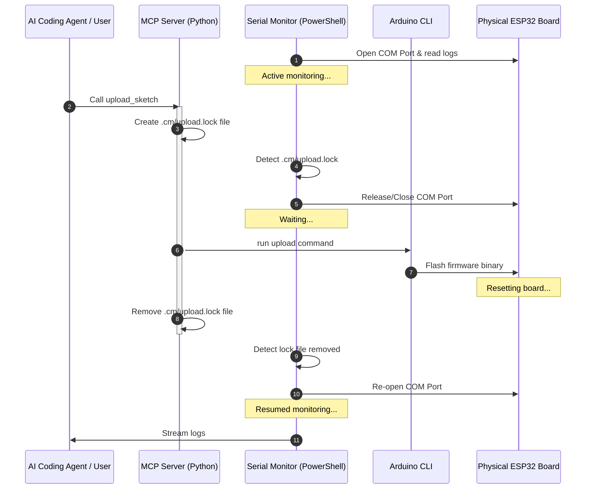
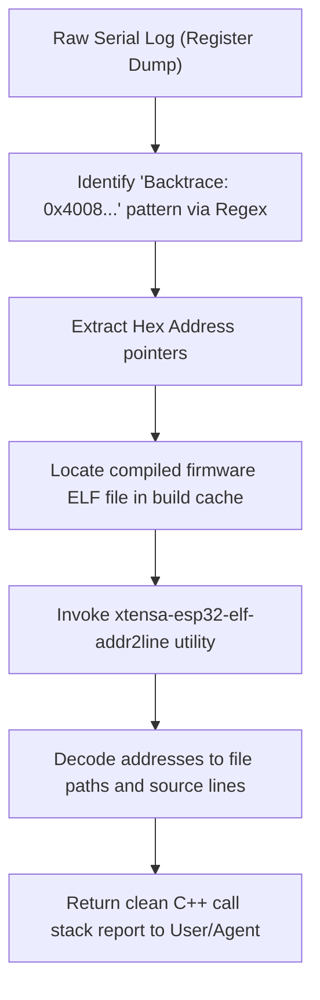
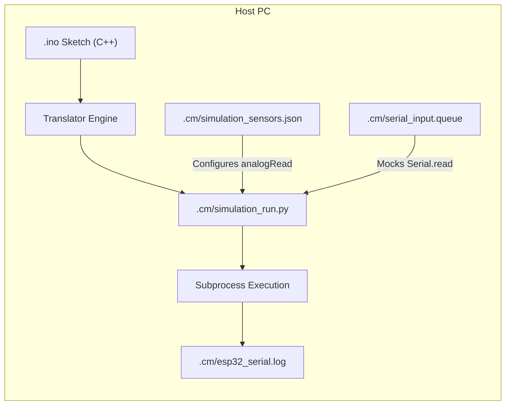

# System Flows / Sơ đồ Luồng hoạt động

This page details the operation sequences and synchronization patterns of the `arduino-esp32-plugin`.

*Trang này mô tả các sơ đồ quy trình hoạt động đồng bộ hóa và vòng đời vận hành hệ thống.*

---

## 🔒 1. Serial Monitor & Flashing Sync Flow
To prevent the common "Port Busy" (COM port sharing conflict) error when running compilation/upload tools, the plugin uses a lock file `.cm/upload.lock`.

*Quy trình khóa đồng bộ tránh xung đột cổng COM bằng tệp khóa lock-file.*

### Flow Explanation / Giải thích Quy trình
1.  **Monitor Listening**: The PowerShell monitor job is actively reading serial output from the ESP32 board.
2.  **Upload Initiated**: The developer or AI agent calls `upload_sketch` via the MCP server.
3.  **Lock File Creation**: The MCP server creates `.cm/upload.lock`.
4.  **Auto-release**: The background monitor detects this file, immediately closes the COM port, and goes into a waiting state.
5.  **Flashing**: The Arduino CLI safely uploads the binary without port conflicts.
6.  **Unlocking**: Once flashing finishes, the MCP server deletes the `.cm/upload.lock` file.
7.  **Auto-reconnect**: The monitor notices the file is gone, reopens the COM port, and resumes logging.

---

## 🛠️ 2. Guru Meditation Exception Stack Decoding Flow
When the ESP32 crashes, it prints a raw register dump to the serial console. The decoding script maps these hex pointers to C++ line numbers.

*Quy trình bóc tách mã lỗi crash và đối chiếu dòng lệnh C++ nguồn.*

### Flow Explanation / Giải thích Quy trình
1.  **Regex Identification**: The decoder searches for the pattern `Backtrace:` followed by one or more hex pointers.
2.  **Addr2line Lookup**: It feeds these pointers into the GNU toolchain `addr2line` utility along with the intermediate `.elf` file built by the compiler.
3.  **Source Mapping**: The output translates addresses to file paths and exact C++ source line numbers.

---

## 💻 3. Virtual Emulation & Waveform Simulation Flow
For offline logic verification, the C++ sketch is translated to Python and runs with sensor waveform mocking.

*Luồng biên dịch giả lập và tạo xung tín hiệu cảm biến ảo.*

### Flow Explanation / Giải thích Quy trình
1.  **Code Translation**: The translation script scans the `.ino` file, removes C++ type specifiers, translates blocks to python indentation, and inserts python mock methods.
2.  **Runtime Emulation**: The generated Python file executes. It maps calls to `analogRead(pin)` to read waveform logic defined in `simulation_sensors.json`.
3.  **I/O Mocking**: Bidirectional communication is fully simulated via log files.
